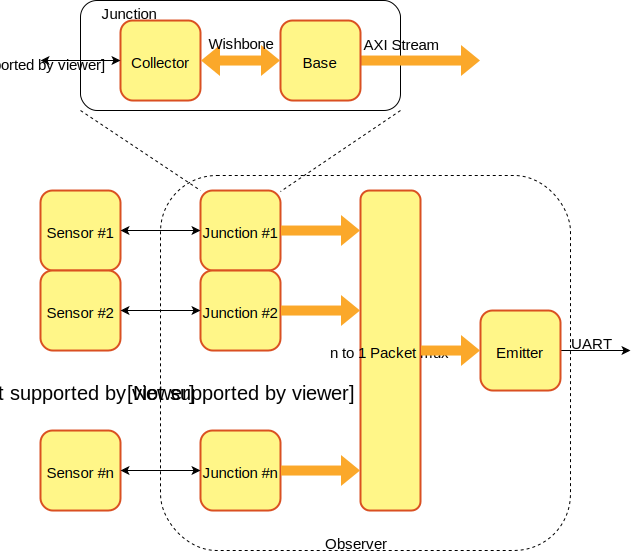
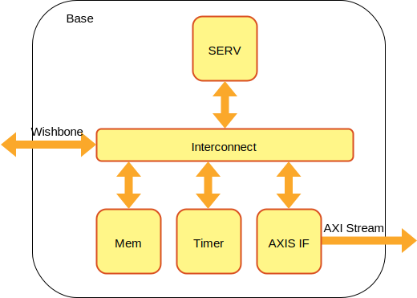

# OBSERVER

OBSERVER is a configurable and software-programmable sensor aggregation platform for heterogenous sensors

## Background

FPGAs are good at many things. They can do many things in parallel, have a lot of I/O pins and can implement pretty much any digital communication protocol. These are all things that make them well suited for collecting data from many different kinds of sensors to build a sensor aggregation platform. A sensor aggregation platform needs a separate interface for each sensor it needs to collect data from and takes care of communication with the sensor and any required postprocessing or data reduction of the sensor data. The end result is then converted to a common format and combined with other sensors' data into an aggregated data stream. The bad news is that implementing the logic for sensor communication, post processing and format conversion directly in an FPGA can quickly become very time-consuming. This is a task much better suited for a CPU. On an FPGA it's no problem to add a soft CPU, but the more sensors that are connected to the CPU, the harder it will have to keep up with any real-time aspects of the data collection.

Observer deals with this by attaching a CPU to each sensor interface that handles all bringup and data collection from the sensor and produces a wel-formed data packet which is then forwarded to a common aggregation node. By using the small [SERV](https://github.com/olofk/serv) RISC-V CPU it is possible to do this without costing much resources. This has a number of benefits. Data collection and post processing from each sensor can be done completely independent of the others. It allows for power savings by doing complex data reduction very close to the sensor and allowing unused nodes to shut down when not in use. Depending on the complexity of the sensor interfacing or post processing, each node can independently decide to do this using a couple of lines of assembly code, a bare-metal C program or even run a RTOS such as Zephyr.

# Overview

The Observer system consists of three different types of components called collector, base and emitter. In addition to this, a pair of collector and base components are together called a junction.

## Collector

The collector is the component that directly interface a sensor to collect data and implements that sensor's protocol such as UART, SPI, I2C or any kind of custom protocol. The other side of the collector exposes a Wishbone slave interface

## Base

The purpose of the base is to control the dataflow between the collector and the emitter. The base consists of a SERV CPU, local memory, a timer, a Wishbone interface towards the collector and an AXI Stream interface where it sends out the processed data as packets.

## Emitter

While the Observer SoC has a junction (collector+base) for each sensor, it uses a common emitter. A packet switched mux is used to arbitrate between all the junctions. Much like the base, the emitter consists of a small SERV SoC with local memory and timer, but with the difference that the emitter receives data from an AXI Stream interface and transmits over UART. The emitter UART is connected to externally to allow the aggregated data to leave the chip.

# Installation

Observer needs a bunch of tools installed. Not all of them are strictly necessary. It all depends on what you want to achieve. Here's a list of things to install. As installation instructions varies between different system, you need to find out the correct ways to install most of these tools yourself.

1. Install FuseSoC `pip install fusesoc` (on many systems, a local installation with `pip install --user fusesoc` is preferred)
2. If you want to simulate the system, install Verilator. GTKWave is pretty handy too
3. If you want to build for the cyc1000 FPGA board, install Intel Quartus
4. If you want to decode the aggregated data stream, install the Python packages pyserial and umsgpack
5. Create and enter a new directory somewhere on your machine. This will be the workspace directory and all subsequent commands will be run from there unless anything else is explicitly stated. This directory will be referred to as `$WORKSPACE` from now on
6. Add observer as a FuseSoC library with `fusesoc library add observer https://github.com/olofk/observer`. If you already have it downloaded somewhere else, you can tell FuseSoC to use that version instead with `fusesoc library add observer /path/to/downloaded/repo`
7. If you haven't already also add the FuseSoC base library. Use `fusesoc library add fusesoc-cores https://github.com/fusesoc/fusesoc-cores` to have the base library available in the current workspace, or `fusesoc library add --global fusesoc-cores https://github.com/fusesoc/fusesoc-cores` to havea it available in all workspaces. The latter is the most common way, but you're free to do what you prefer.

# Usage

As observer is a configurable platform, it can be adapted to use different sets of junctions and support different FPGA boards. A fixed set of junctions for a specific hardware is called a target. To find all the currently supported targets, run

    fusesoc core show observer

This should list all targets together with a short description of them.

## Run in simulation

With Verilator installed, we can now run a simulation. Run

    fusesoc run --target=sim observer --timeout=50000000 --uart_baudrate=57600 --vcd

to build and launch the simulation, telling it to exit after 50000000 ns, decode the output of the emitter as a UART signal with baud rate 57600 and produce a VCD file (in `build/observer_0/sim-verilator/trace.vcd` if you want to look at it). The simulation should print out a lot strings, most of them saying "Base x says hello", together with some gibberish.

The options listed after `observer` are specific to the selected target (`sim` in this case). To see what options are available for a specific target ($target), run

    fusesoc run --target=$target observer --help

## Run on hardware

If we instead want to produce an FPGA image for the cyc1000 board, we can run

    fusesoc run --target=cyc1000 observer

This will invoke Quartus to build an FPGA image and try to program the board afterwards if it's connected.

If everything works as intended, we should now be able to connect to the UART on the FPGA that is tunneled through the microUSB cable and listen to the aggregated data stream. The name of the device to connect to is likely specific to your OS, but on my machine it appears as `/dev/ttyUSB0`. We therefore launch the data stream decoder with

    python fusesoc_libraries/observer/sw/observe.py /dev/ttyUSB0

If the data now comes whishing by, you can try to press the user button on the board and see the corresponding switch between True and False in the data stream. As the 3-axis accelerometer is also connected, tilting the board should produce different y-val values.

As there aren't any more built-in sensors on the cyc1000 board, there's no need for additional junctions, but let's pretend we have connected a lot of other sensors to the board. To show off what it could look like if we had and additional 26 sensors there is a target called `cyc1000_full` with 29 junctions. The additional junctions will just produce a text string created internally in the base, but the purpose is to investigate resource usage of a maxed out system.

Running

    fusesoc run --target=cyc1000_full observer

will create and download an FPGA image with junctions. Looking at resource usage, this only uses ~50% of the FPGA logic resources which means there are plenty of space to implement collectors for all of the sensors.

## Creating a new target

## Creating a new junction

## Creating a new collector

